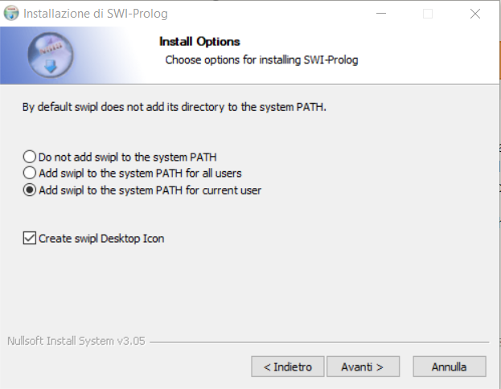
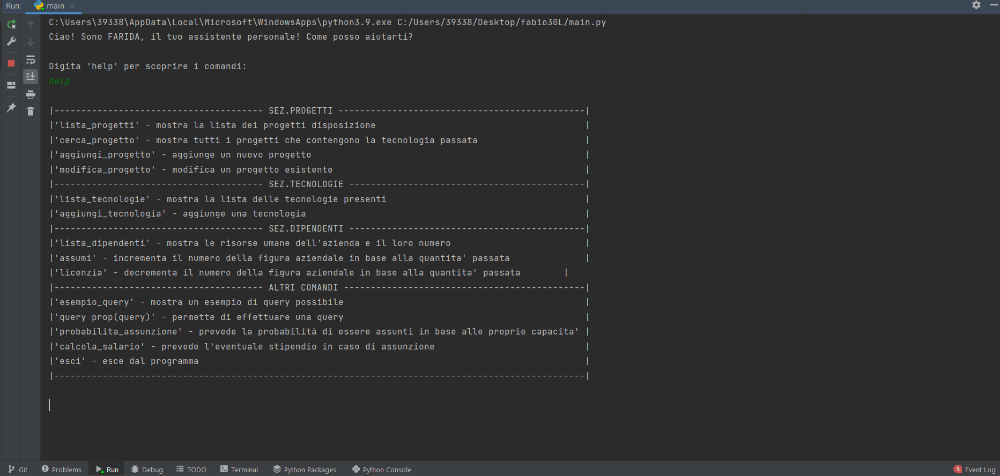
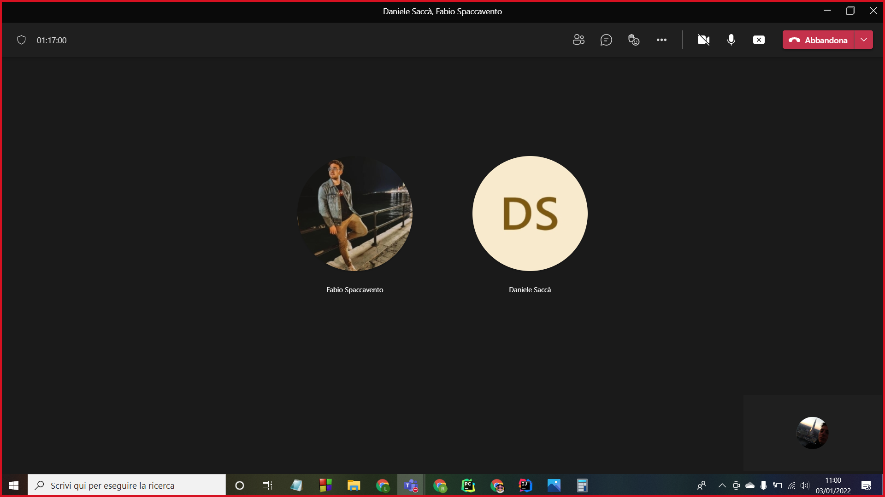

# Relazione tecnica

### Indice

1. [Introduzione](#Introduzione)
2. [Requisiti funzionali](#Requisiti-funzionali)
3. [Manuale utente](#Manuale-utente)
4. [Scelte progettuali](#Scelte-progettuali)
5. [Implementazioni future](#Implementazioni-future)
6. [Processo di sviluppo e organizzazione del lavoro](#Processo-di-sviluppo-e-organizzazione-del-lavoro)
7. [Conclusioni](#Conclusioni)

## **Introduzione**

Questo documento ha il compito di illustrare l’utilizzo della prima versione dell’applicazione **FARIDA**.

L'applicativo software, oggetto del documento, è stato sviluppato dal gruppo composto da: 

* **[Fabio Spaccavento](https://github.com/fabiospaccavento)** (Matricola: 727299)
* **[Riccardo Ranieri](https://github.com/RickNewere)** (Matricola: 706350)
* **[Daniele Saccà](https://github.com/danielesacca)** (Matricola: 726020)

Il nome dell'applicativo sono le iniziali del nome dei membri del gruppo.

L'assistente virtuale intelligente **FARIDA** nasce con lo scopo di aiutare aziende informatiche nella gestione dei
dipendenti, dei progetti e delle tecnologie utilizzate all'interno di un'azienda.

Si è scelto di creare da zero il progetto e la base di conoscenza, piuttosto che scaricare l'applicativo software/il 
dataset da Internet, in quanto il gruppo ha visto questo progetto come un'opportunità di applicare le conoscenze teoriche
apprese durante il corso.

[Torna all'inizio](#Indice)

## **Requisiti funzionali**

Per avviare correttamente il programma è necessario installare:

* 'pybbn' tramite il comando da terminale ```pip install pybbn``` per la predizione;
* 'pandas' tramite il comando da terminale ```pip install pandas``` per il classificatore;
* 'sklearn.tree' tramite il comando da terminale ```pip install scikit-learn``` per il classificatore; 
* 'pyswip' tramite il comando da terminale ```pip install pyswip``` per la KB;
* installare [Swi-Prolog](https://www.swi-prolog.org/) (sito ufficiale). Una volta nel sito, andare nella sezione download,
selezionare ```stable release```, scaricare la versione adatta al proprio sistema operativo. Eseguito il download,
è necessario installare il programma sulla propria macchina e spuntare la casella ```Add swipl to the system PATH for current user```.

<center></center>

[Torna all'inizio](#Indice)

## **Manuale utente**

La prima volta che si importa il progetto, la compilazione potrebbe richiedere qualche secondo in più!

Quando il programma sarà avviato verrà visualizzato il messaggio a linea di comando:
<center>

```Ciao! Sono FARIDA, il tuo assistente personale! Come posso aiutarti?```

```Digita 'help' per scoprire i comandi:```

</center>

Se avviato correttammente da questo momento in poi si potranno utilizzare i seguenti comandi:

* ```help``` - comando che viene suggerito dal banner iniziale, e che se invocato mostra la lista dei comandi disponibili. Al termine di ogni comando eseguito riapparirà così da suggerire all'utente cosa fare.
* ```lista_progetti``` - comando utilizzato per visualizzare la lista completa dei progetti. Successivamente, se inserito il nome di un progetto esistente, il comando mostrerà le tecnologie utilizzate e le figure impegnate nello sviluppo del progetto ricercato. Qualora venga inserito il comando ```back```, l'utente sarà riportato alla main page. Nel caso in cui venga inserito un nome di progetto inesistente verrà richiesto di ridigitare l'input.
* ```cerca_progetto``` - comando utilizzato per cercare un progetto in base alla tecnologia specificata. Il risultato sarà una lista di progetti che sfruttano quella tecnologia.
* ```aggiungi_progetto``` - comando utilizzato per inserire un nuovo progetto. Si richiede all'utente di inserire il nome del progetto, numero e nome delle tecnologie utilizzate e numero e nome delle figure che lavorano al progetto.
* ```modifica_progetto``` - comando utilizzato per modificare un progetto già esistente. Dato il nome di un progetto esistente, vengono modificati numero e nome delle tecnologie utilizzate e delle figure coinvolte nel progetto.
* ```lista_tecnologie``` - comando utilizzato per visualizzare la lista completa delle tecnologie. Mostra anche i tipi di itTechnologies utilizzati all'interno dell'azienda.
* ```aggiungi_tecnologia``` - comando utilizzato per creare una nuova tecnologia e (opzionale*) un nuovo tipo di tecnologia. *Se già esistente utilizzerà quella.
* ```lista_dipendenti``` - comando utilizzato per visualizzare la lista completa dei dipendenti all'interno dell'azienda e la loro quantità. Suggerisce inoltre le figure da assumere qualora manchino.
* ```assumi``` - comando utilizzato per aggiungere una quantità di dipendenti in base alla figura professionale passata. 
* ```licenzia``` - comando utilizzato per rimuovere una quantità di dipendenti in base alla figura professionale passata.
* ```esempio_query``` - comando utilizzato per mostrare all'utente come effettuare una query alla kb. Riporta, inoltre, il formato corretto dell'output.
* ```query prop(query)``` - comando utilizzato per esprimere una query alla kb. 
* ```probabilita_assunzione``` - comando che, in base alle risposte dell'utente, prevede la probabilità che quest'ultimo possa essere assunto.
* ```calcola_salario``` - comando che, in base all'età, all'esperienza e al sesso prevede il salario annuale che l'utente percepirà.
* ```esci``` - comando per terminare l'applicazione.

Una volta terminato correttamente il programma, verrà visualizzato a linea di comando il seguente messaggio:

<center>

```A presto!```

</center>

In seguito, l'applicazione verrà chiusa.

Sono, inoltre, gestiti tutti i casi in cui l'utente inserisce qualcosa di diverso rispetto a ciò che è stato chiesto!

Esempio di linea di comando: 

<center></center>

[Torna all'inizio](#Indice)

## **Scelte progettuali**

Nel nostro applicativo software si è scelto di utilizzare:

* Una [base di conoscenza](https://it.wikipedia.org/wiki/Base_di_conoscenza), ordinata secondo la rappresentazione Individuo-Proprietà-Valore, scritta interamente dal gruppo, che verrà interrogata tramite query. Queste 
verranno utilizzate all'interno di metodi specifici. Si è scelta la sopraccitata rappresentazione poichè è stata ritenuta la più human readable e la più ordinata secondo il nostro punto di vista.
* Un [classificatore](https://it.wikipedia.org/wiki/Classificazione) in grado di restituire la classe salariale dell'utente in base alle informazioni che fornirà.
* Una [rete bayesiana](https://it.wikipedia.org/wiki/Rete_bayesiana) in grado di predire la probabilità con cui l'utente che esegue il programma possa essere assunto
nell'azienda in base alle proprie competenze scientifiche. Si è scelto di utilizzare la rete bayesiana poichè ci può essere incertezza data da alcuni fattori, così da avere una stima 
generale.

### **Base di Conoscenza**

Abbiamo dotato il nostro applicativo di una base di conoscenza scritta interamente da noi in [Prolog](https://it.wikipedia.org/wiki/Prolog), linguaggio di programmazione logica. Abbiamo dotato la base di conoscenza di predicati e regole che saranno utilizzati
nell'interrogazione della KB. Le query vengono utilizzate nei seguenti comandi:

* ```lista_progetti```;
* ```cerca_progetto```;
* ```aggiungi_progetto```;
* ```modifica_progetto```;
* ```lista_tecnologie```;
* ```aggiungi_tecnologia```;
* ```lista_dipendenti```;
* ```assumi```;
* ```licenzia```;
* ```esempio_query```;
* ```query prop(query)```.

### **Classificatore**

Il programma è stato dotato di una funzione che sfrutta un classificatore per determinare la classe salariale a cui apparterrà l'utente una volta assunto.
Abbiamo utilizzato un [file CSV](https://it.wikipedia.org/wiki/Comma-separated_values) per addestrare il nostro classificatore. Le informazioni che l'utente deve inserire sono:

* ```Age```;
* ```Sex```;
* ```Years Experience```;
* ```Salary```.

Ad ogni campo sono stati associati i seguenti valori:

* Per l'età, un intero;
* Per il sesso, sono stati mappati i valori nella seguente modalità:
<center>

| Sex = Male | Sex = Female |
|---|--------------|
| 0 | 1            | 

</center>

* Per l'esperienza in azienda, un float;
* Per il salario annuale, un range di valori.

Il risultato della funzione ```calcola_salario``` sarà un range di salario a cui l'utente potrà ambire. Fornito l'esempio, l'algoritmo restituisce la classe a cui potrebbe appertenere. Le classi possibili sono:

* ```20000-30000€```;
* ```30000-40000€```;
* ```40000-50000€```;
* ```50000-60000€```;
* ```60000-70000€```.

### **Rete Bayesiana**

Nel nostro applicativo è stata implementata una funzione che sfrutta una Rete Bayesiana. Questa è in grado di predire la percentuale di possibilità di assunzione dell'utente nell'azienda. L'assistente, infatti, ponendo delle domande 
all'utente, calcolerà un float compreso tra 0 e 1, che moltiplicato per 100 darà come risultato la percentuale di possibilità di assunzione. In base alla percentuale restituita:
* se la percentuale è ```< 26%``` la predizione rientrerà nella fascia ```bassa```;
* se la percentuale è ```< 40%``` la predizione rientrerà nella fascia ```medio-bassa```;
* se la percentuale è ```< 50%``` la predizione rientrerà nella fascia ```media```;
* se la percentuale è ```< 70%``` la predizione rientrerà nella fascia ```medio-alta```;
* se la percentuale è ```>= 70%``` la predizione rientrerà nella fascia ```alta```.

Ogni risposta è pesata differentemente e queste percentuali sono determinate da:

* **Titolo**: titolo di studio conseguito dall'utente;  
* **Esperienza Pregressa**: se l'utente ha mai lavorato in un'azienda;
* **Valore Personale**: padre di ```Titolo``` e di ```Esperienza pregressa```;
* **Passione Informatica**: se l'utente è appassionato al mondo informatico;
* **Sviluppo Web**: preferenza tra programmazione [Back End](https://www.geekandjob.com/carriera/back-end-developer) e programmazione [Front End](https://www.a-sapiens.it/informatica/risorse/come-diventare-front-end-developer/);
* **Valore Informatico**: padre di ```Passione Informatica``` e di ```Sviluppo Web```;
* **Punteggio Personale**: padre di ```Valore Personale``` e di ```Valore Informatico```;
* **Conoscenza Java**: se l'utente conosce il linguaggio di programmazione [Java](https://it.wikipedia.org/wiki/Java_(linguaggio_di_programmazione));
* **Conoscenza Python**: se l'utente conosce il linguaggio di programmazione [Python](https://it.wikipedia.org/wiki/Python)
* **Conoscenza Linguaggi**: padre di ```Conoscenza Java``` e di ```Conoscenza Python```;
* **Conoscenza MySQL**: se l'utente conosce il linguaggio di riferimento per database relazionali [MySQL](https://it.wikipedia.org/wiki/MySQL);
* **Conoscenza MongoDB**: se l'utente conosce il linguaggio di riferimento per database non relazionali [MongoDB](https://it.wikipedia.org/wiki/MongoDB);
* **Conoscenza DB**: padre di ```Conoscenza MySQL``` e di ```Conoscenza MongoDB```;
* **Valore Lavorativo**: padre di ```Conoscenza Linguaggi``` e di ```Conoscenza DB```;
* **Previsione Assunzione**: padre di ```Punteggio Personale``` e di ```Valore Lavorativo```;


[Torna all'inizio](#Indice)

## **Implementazioni future**

In futuro, alcune feature che potrebbero essere implementate sono:

1. Inserimento GUI;
2. Progetti con richieste dettagliate;
3. Controlli sul numero di assunzioni;
4. Consigli sull'assunzione di determinato personale in base ai tipi di progetti;
5. Stima del tempo per il completamento di un progetto;
6. Richiesta di particolari dipendenti in base alle tecnologie utilizzate all'interno di un progetto.
7. Differenziare i comandi disponibili in base al tipo di utente che accede all'assistente.

[Torna all'inizio](#Indice)

## **Processo di sviluppo e organizzazione del lavoro**

Il progetto è stato sviluppato a partire da Dicembre 2021 fino a metà Gennaio 2022 completamente in remoto.

## **Piattaforme di comunicazione**

Per la comunicazione, il nostro gruppo, ha adottato due piattaforme:

* **[Microsoft Teams](https://discord.com/brand-new)**
* **[Whatsapp](https://www.whatsapp.com/?lang=it)**

La prima è stata scelta poichè una piattaforma a tutti i membri del gruppo familiare, la quale permetteva di organizzare videoconferenze e di condividere lo schermo. Ciò è stato molto utile nel momento in cui sorgevano difficoltà in quanto si poteva risolvere il problema tutti insieme.

<center></center>

La seconda è stata scelta poichè, essendo anche questa familiare, era il mezzo di comunicazione più immediata. Tramite questa piattaforma, è stato possibile confrontarsi durante lo sviluppo, decidere i giorni e gli orari per i nostri meeting e tenersi contatto.

<center></center>

[Torna all'inizio](#Indice)

## **Conclusioni**

Come detto in precedenza, riteniamo che questo progetto sia stato un importante banco di prova. Nonostante le difficoltà siamo riusciti comunque a centrare gli obiettivi stabiliti e a trarre il meglio da questa esperienza formativa.

Rigraziamo per l'attenzione. 

<center>

Lo staff, **[FARIDA](https://github.com/RickNewere/FARIDA.git)**

</center>

[Torna all'inizio](#Indice)